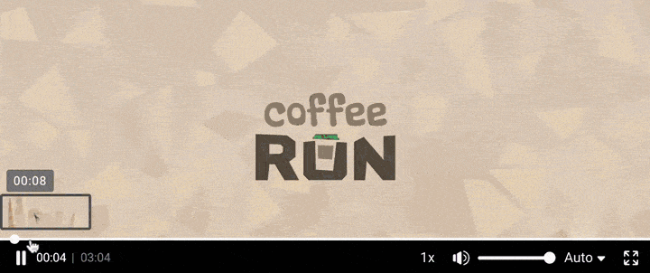
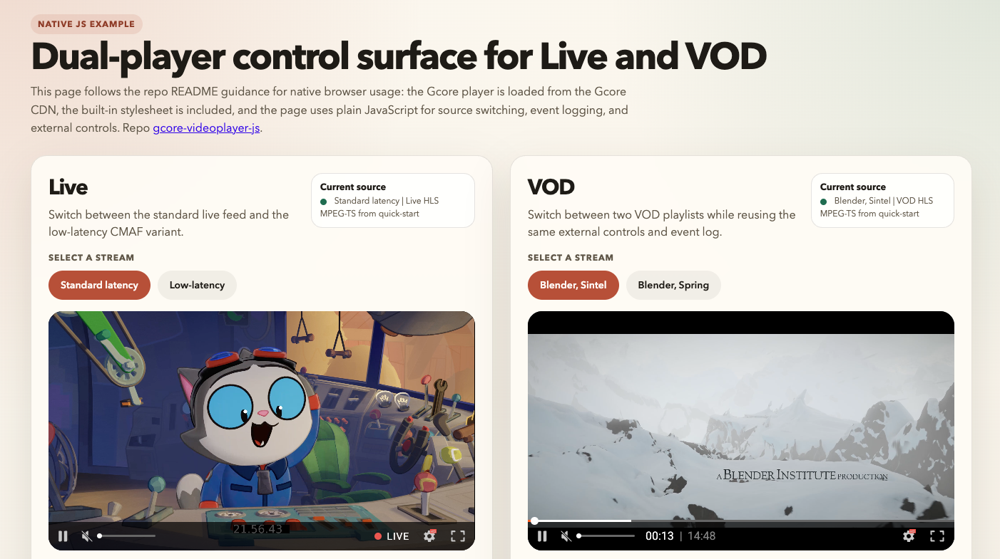
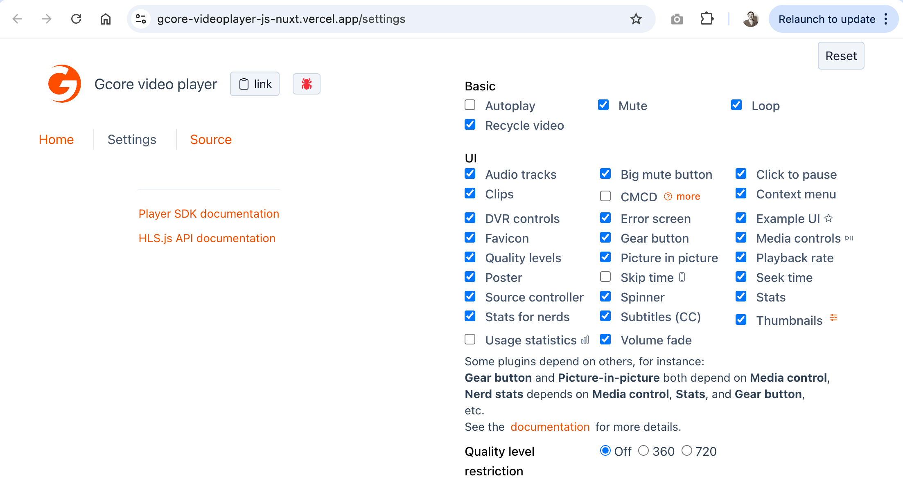

# Gcore JavaScript Video Player SDK

This repository contains the Gcore JavaScript Video Player SDK for web applications.

It is designed for teams that need native page integration, product-level control, and a flexible playback experience for live streams and VOD.

The player acts as a unified playback layer over modern engines, including `hls.js` for HLS, `dash.js` for MPEG-DASH, and native HTML `<video>` playback for browsers such as Safari that require it. Customers do not need to build and maintain that wrapper themselves: Gcore provides a tested, compiled, production-ready solution.

## Playback preview

### Live


Protocols: HLS MPEG-TS, HLS CMAF, LL-HLS, MPEG-DASH  
Top features: low latency, adaptive bitrate, broad device coverage  
More: <https://gcore.com/docs/streaming/live-streams-and-videos-protocols-and-codecs/output-parameters-and-codecs>

### VOD



Protocols: HLS MPEG-TS, HLS CMAF, MPEG-DASH CMAF, MP4  
Top features: adaptive bitrate, modern streaming formats, simple MP4 playback  
More: <https://gcore.com/docs/streaming/video-hosting/hls-and-mp4>


## What the SDK supports

```text
+--------------------------------------------------------------+
| Web page / web application                                   |
|                                                              |
|  +--------------------------------------------------------+  |
|  | Gcore JavaScript Player SDK                            |  |
|  |                                                        |  |
|  |  Playback: Live / VOD / HLS / DASH / MP4              |  |
|  |                                                        |  |
|  |  +--------------------------------------------------+  |  |
|  |  | Plugins                                          |  |  |
|  |  | MediaControl, Subtitles, QualityLevels,          |  |  |
|  |  | PlaybackRate, Poster, Spinner, Telemetry, etc.   |  |  |
|  |  +--------------------------------------------------+  |  |
|  +--------------------------------------------------------+  |
+--------------------------------------------------------------+
```

- Multiple sources, auto-detect playable input, autoplay, loop playback, mute on start, show a poster or thumbnail before playback.
- Customization: apply custom CSS skinning, hide built-in UI components, choose only the plugins you need, or build your own interface on top of the playback API.
- Live playback for HLS and MPEG-DASH streams, including workflows that need DVR-style live controls.
- VOD playback for HLS, MPEG-DASH, and MP4 sources.
- Framework-agnostic web integration for vanilla JavaScript, React, Vue, Nuxt, and other SPA/MPA setups.
- Direct JavaScript control over play, pause, seek, mute, volume, source loading, resize, and lifecycle.
- Event-driven integrations for player state, playback progress, errors, fullscreen, and volume changes.
- Extensible UI through plugins for media controls, subtitles, audio track selection, quality selection, playback speed, picture-in-picture, thumbnails, posters, DVR controls, multi-camera, logos, sharing, telemetry, CMCD, and more.
- Multiple source support with transport preference and automatic source failover logic.
- Localization and custom strings for product teams that need branded or localized playback UX.

## Live and VOD support

### Live

Use the SDK for live channels and events delivered through:

- HLS playlists: `.m3u8`
- MPEG-DASH manifests: `.mpd`

For live workflows, the player can expose controls that make sense for live viewing, including DVR-oriented experiences when the stream window allows it.

### VOD

Use the SDK for on-demand playback delivered through:

- HLS: `.m3u8`
- MPEG-DASH: `.mpd`
- MP4 files: `.mp4`

This covers typical OTT and video platform delivery patterns where the same asset may be available in more than one transport.

## Quick start

- Follow [Install and configure guide](./docs/install-and-configure.md) for installation and configuration.
- Follow [Quick start guide](./docs/quick-start.md) for basic usage.

## Developer view, at a high level

### Integration with web apps

From an integration perspective, the SDK gives developers four main building blocks:

1. `Player` as the main runtime object that attaches to a DOM node and controls playback.
2. `sources` configuration for HLS, DASH, and MP4 inputs, with optional transport preference.
3. Built-in events and methods for app integration.
4. A plugin model for extending UI, controls, analytics, and playback behavior without rebuilding the player core.

```text
Web page / application
|
+-- App code
|   |
|   +-- import { Player, MediaControl, Subtitles, QualityLevels, ... }
|   +-- Player.registerPlugin(MediaControl)
|   +-- Player.registerPlugin(Subtitles)
|   +-- Player.registerPlugin(QualityLevels)
|   +-- const player = new Player({ sources, ...config })
|   +-- player.attachTo(document.getElementById('player'))
|
+-- DOM
    |
    +-- <div id="player"></div>
        |
        +-- Gcore JS Player runtime
            |
            +-- Playback core
            |   +-- hls.js / dash.js / native <video>
            |
            +-- Plugin layer
                +-- MediaControl
                +-- Subtitles / AudioTracks
                +-- QualityLevels / PlaybackRate
                +-- Poster / Spinner / ErrorScreen
                +-- Telemetry / CMCD / other plugins
```

Typical developer workflows:

- register the built-in plugins you need
- create the player with one or more media sources
- attach it to a container in the page
- subscribe to events and connect them to your product logic
- configure branding, localization, telemetry, and playback UX

Tutorial documentation is also available in Gcore product docs:
<https://gcore.com/docs/streaming/api/player-api-tutorial>

Install and configuration guide for this repository: [docs/install-and-configure.md](./docs/install-and-configure.md)

### Plugins

The SDK plugin model is grouped in the same way as the product tutorial: `Playback`, `UI`, and `Analytics`.

| Category | Feature | Description |
| --- | --- | --- |
| `Playback` | `AudioTracks` | Switch available audio tracks |
|  | `ClickToPause` | Toggle playback by clicking on the video area |
|  | `Clips` | Add markers or segments to the VOD timeline |
|  | `DvrControls` | Add DVR controls for live playback |
|  | `MultiCamera` | Load and switch between multiple camera streams |
|  | `PictureInPicture` | Enable picture-in-picture mode |
|  | `PlaybackRate` | Change playback speed |
|  | `Poster` | Show a poster image and a big play state before playback |
|  | `QualityLevels` | Let viewers change video quality manually |
|  | `SeekTime` | Show the target time while hovering the seek bar |
|  | `Share` | Share the current video from the player UI |
|  | `SkipTime` | Jump forward or backward with tap controls |
|  | `SourceController` | Play one or several media sources with automatic switching and failover |
|  | `Subtitles` / `ClosedCaptions` | Select subtitle or caption tracks |
|  | `Thumbnails` | Show preview thumbnails over the timeline |
| `UI` | `BigMuteButton` | Show a prominent unmute button for muted autoplay flows |
|  | `BottomGear` | Extend the control bar with additional settings/actions |
|  | `ContextMenu` | Show a custom context menu inside the player |
|  | `ErrorScreen` | Display playback errors in an overlay |
|  | `Favicon` | Change the browser tab icon based on player state |
|  | `Logo` | Add a custom logo to the player |
|  | `MediaControl` | Main player control bar and interaction layer |
|  | `Spinner` | Show a buffering/loading indicator |
|  | `VolumeFade` | Fade audio in on hover |
| `Analytics` | `ClapprStats` | Expose playback metrics for analysis |
|  | `CmcdConfig` | Send CMCD metadata with playback requests |
|  | `GoogleAnalytics` | Report playback events to Google Analytics |
|  | `NerdStats` | Show detailed playback and network diagnostics |
|  | `Telemetry` | Collect and send performance statistics |

API details for plugins: [packages/player/docs/api/player.md](./packages/player/docs/api/player.md)  

## Demos

### Vanilla JS demo

Live demo: <https://g-core.github.io/gcore-videoplayer-js/example/index.html>

This demo includes both VOD and live streams. The players are embedded directly into the page with custom controls and dedicated log panels, making playback events easy to follow. The demo is available 24/7.




### Interactive demo with plugin settings

Interactive live demo: <https://gcore-videoplayer-js-nuxt.vercel.app/settings>



## Iframe player vs JavaScript player

As an alternative, Gcore also offers a built-in iframe player. If you need to compare capabilities, use the table below.

| Option | Best for | Pros | Cons |
| --- | --- | --- | --- |
| JavaScript player SDK | Productized playback inside a real web app | Native DOM integration, full control over UI and behavior, richer analytics and event handling, extensible with plugins | Requires frontend implementation, configuration, testing, and ownership by the product team |
| Built-in iframe player | Fast launch, simple embeds, low engineering effort | Quickest integration, isolated player updates, minimal frontend work | Limited page-level control, harder to deeply customize UX, weaker integration with site analytics and app state |

Choose the JavaScript SDK when playback is part of your product experience and needs to behave like the rest of your application. Choose the iframe player when you need a no-code solution.

More about the built-in iframe player: <https://gcore.com/docs/streaming/extra-features/customize-appearance-of-the-built-in-player>

## Documentation

- Human-facing package usage: [packages/player/README.md](./packages/player/README.md)
- Product tutorial documentation: <https://gcore.com/docs/streaming/api/player-api-tutorial>
- Project knowledge index: [DOCS.md](./DOCS.md)
- Architecture and deep tech details: [docs/architecture.md](./docs/architecture.md)
- Code map: [docs/codemap.md](./docs/codemap.md)
- Install and configure guide: [docs/install-and-configure.md](./docs/install-and-configure.md)
- Quick start guide: [docs/quick-start.md](./docs/quick-start.md)
- Framework integration (React, Vue, Next.js, Nuxt, Svelte): [docs/framework-integration.md](./docs/framework-integration.md)
- Code examples and recipes: [EXAMPLES.md](./EXAMPLES.md)
- AI-assisted development guide: [AI-DEVELOPMENT.md](./AI-DEVELOPMENT.md)
- PlayerConfig JSON Schema: [docs/player-config.schema.json](./docs/player-config.schema.json)
- Generated API reference: [packages/player/docs/api/player.md](./packages/player/docs/api/player.md)

## Missing the feature you need?

Gcore is highly customer-oriented. If a capability is missing, that usually means there has not yet been a requirement to implement it. The player can be adapted to customer needs, so if you need something beyond the current feature set, contact Gcore to discuss the right solution.
